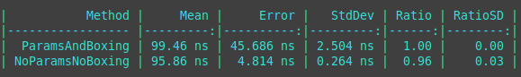
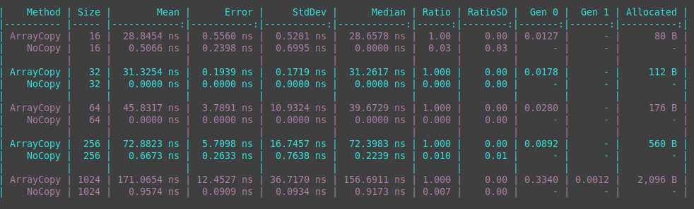

# Performance tricks I learned from contributing to the Azure .NET SDK

As a practical learner, I've found that performance optimizations have been my biggest challenge and the place I've learned the tricks that are the most helpful. These lessons have come by trial and error. As it turns out, the Azure .NET SDK was a perfect “playground” for learning new tricks because it's maintained by people who care and give feedback. 

Over the past few years, I've contributed over fifty pull requests to the Azure .NET SDK and some of them got accepted. In this session, I'll walk you through the performance improvements I learned from my experiments. Some “superpowers” you will learn are spotting closure allocations and opportunities for memory pooling and, best of all, how to improve them. 

- [Slides Online](https://danielmarbach.github.io/PerformanceTricksAzureSDK)
- [Slides PDF](/slides/presentation.pdf)
- [Webinar Recording](https://www.youtube.com/watch?v=ztABfkJozXQ)
- [Jetbrains Online Day Recording](https://www.youtube.com/watch?v=NELaITuylDg)

## Introduction

In this talk, I'm going to focus on some performance optimizations that can be done in code that is library and framework like. I won't be talking about architectural patterns like vertical or horizontal scaling. I will also not be talking about how to use Benchmarking Tools like Benchmark.NET or give an introduction into profilers. If you are interested in that topic I have linked some interesting talks in the readme of the presentation repository.

The focus is purely on code with examples in CSharp. .NET has been evolving over the years into a modern and high-performance platform. The languages running on .NET have also been improving and allowing to fall to lower levels without giving up on the safety guarantees too much or only where it is really needed. It is less and less needed to use unmanaged languages like C/C++ to achieve code that performs well at scale.

Some optimizations shown here can be seen as esoteric in typical line of business applications, and I wouldn't recommend jumping to conclusions and applying those everywhere. It is important to note that for code that is executed under scale, optimizations on code can bring a lot of benefit to the table due to not only being fast but also being more efficient in resource usage, execution time, throughput and memory usage.

But what does at scale even mean? How can I find out whether the optimizations I'm trying to make have value, and I'm not getting called out by my colleagues for premature optimizations?

## What does at scale mean?

I've heard countless times already: "Wow, that's crazy, is the complexity of this change really worth it? Isn't that premature optimization?" While it is true that performance improvements can be addictive, it is also true that nobody likes to optimize code that is "fast enough" or is only executed a few times a day as a background job. 

> David Fowler: Scale for an application can mean the number of users that will concurrently connect to the application at any given time, the amount of input to process (for example the size of the data) or the number of times data needs to be processed (for example the number of requests per second). For us, as engineers, it means we have to know what to ignore and knowing what to pay close attention to.

A good way to explore what scale means is to discover the assumptions that have accumulated over time in a given code base by paying close attention to what is instantiated, parsed, processed etc. per request and how those assumptions in the code base affect the performance characteristics (memory, throughput...) at scale.

## General rules of thumb

- Avoid excessive allocations to reduce the GC overhead
  - Be aware of closure allocations
  - Be aware of parameter overloads
  - Where possible and feasible use value types but pay attention to unnecessary boxing
  - Think at least twice before using LINQ or unnecessary enumeration on the hot path
  - Pool and re-use buffers
  - For smaller local buffers, consider using the stack
- Avoid unnecessary copying of memory
  - Watch out for immutable/readonly data that is copied
  - Look for Stream and Byte-Array usages that are copied or manipulated without using `Span` or `Memory`
  - Replace existing data manipulation methods with newer `Span` or `Memory` based variants

## Avoid excessive allocations to reduce the GC overhead

### Think at least twice before using LINQ or unnecessary enumeration on the hot path

LINQ is great, and I wouldn't want to miss it at all. Yet, on the hot path it is far too easy to get into troubles with LINQ because it can cause hidden allocations and is difficult for the JIT to optimize. Let's look at a piece of code from the `AmqpReceiver` (The "driver" behind Service Bus and Event Hub Message/Event receival)

```csharp
public class AmqpReceiver 
{
    ConcurrentBag<Guid> _lockedMessages = new ();
    
    public Task CompleteAsync(IEnumerable<string> lockTokens) => CompleteInternalAsync(lockTokens);
    
    private Task CompleteInternalAsync(IEnumerable<string> lockTokens) 
    {
        Guid[] lockTokenGuids = lockTokens.Select(token => new Guid(token)).ToArray();
        if (lockTokenGuids.Any(lockToken => _lockedMessages.Contains(lockToken))) 
        {
          // do special path accessing lockTokenGuids
          return Task.CompletedTask;
        }
        // do normal path accessing lockTokenGuids
        return Task.CompletedTask;
    }
}
```
The public API accepts the broadest possible enumeration type `IEnumerable<T>` by design and then converts the strings into `Guid`. Then it checks by using `Any` whether there is a lock token contained in the provided tokens that was previously already seen. Let's look how the code looks like in the decompiler

```csharp
public class AmqpReceiver
{
    [Serializable]
    [CompilerGenerated]
    private sealed class <>c
    {
        public static readonly <>c <>9 = new <>c();

        public static Func<string, Guid> <>9__2_0;

        internal Guid <CompleteInternalAsync>b__2_0(string token)
        {
            return new Guid(token);
        }

    }

    // omitted for brevity

    private Task CompleteInternalAsync(IEnumerable<string> lockTokens)
    {
        Enumerable.Any(Enumerable.ToArray(Enumerable.Select(lockTokens, <>c.<>9__2_0 ?? (<>c.<>9__2_0 = new Func<string, Guid>(<>c.<>9.<CompleteInternalAsync>b__2_0)))), new Func<Guid, bool>(<CompleteInternalAsync>b__2_1));
        return Task.CompletedTask;
    }

    [CompilerGenerated]
    private bool <CompleteInternalAsync>b__2_1(Guid lockToken)
    {
        return Enumerable.Contains(_lockedMessages, lockToken);
    }
}
```

For every call of CompleteInternalAsync a new instance of `Func<Guid, bool>` is allocated that points to `<CompleteInternalAsync>b__2_1`. A closure captures the `_lockedMessages` and the `lockToken` as state. This allocation is unnecessary. 

```csharp
    public Task CompleteAsync(IEnumerable<string> lockTokens) => CompleteInternalAsync(lockTokens);

    private Task CompleteInternalAsync(IEnumerable<string> lockTokens) 
    {
        Guid[] lockTokenGuids = lockTokens.Select(token => new Guid(token)).ToArray();
        foreach (var tokenGuid in lockTokenGuids) 
        {
           if (_requestResponseLockedMessages.Contains(tokenGuid))
           {
               return Task.CompletedTask;
           }
        }
        return Task.CompletedTask;
    }
```

get decompiled down to

```csharp
    private Task CompleteInternalAsync(IEnumerable<string> lockTokens)
    {
        Guid[] array = Enumerable.ToArray(Enumerable.Select(lockTokens, <>c.<>9__2_0 ?? (<>c.<>9__2_0 = new Func<string, Guid>(<>c.<>9.<CompleteInternalAsync>b__2_0))));
        int num = 0;
        while (num < array.Length)
        {
            Guid item = array[num];
            if (_requestResponseLockedMessages.Contains(item))
            {
                return Task.CompletedTask;
            }
            num++;
        }
        return Task.CompletedTask;
    }
```

Let's see what we got here.


By getting rid of the `Any` we were able to squeeze out some good performance improvements. Sometimes, though, we can do even more. For example, there are a few general rules we can follow when we refactor a code path using LINQ to collection-based operations. 

- Use `Array.Empty<T>` to represent empty arrays
- Use `Enumerable.Empty<T>` to represent empty enumerables
- When the size of the items to be added to the collection are known upfront, initialize the collection with the correct count to prevent the collection from growing and thus allocating more and reshuffling things internally
- Use the concrete collection type instead of interfaces or abstract types. For example, when enumerating through a `List<T>` with `foreach` it uses a non-allocating `List<T>.Enumerator` struct. But when it is used through for example `IEnumerable<T>` that struct is boxed to `IEnumerator<T>` in the foreach and thus allocates. Of course for public APIs it is sometimes better to use the most generic type to be as broadly applicable as possible. Mileage may vary.
- With more modern CSharp versions that have good pattern matching support, it is sometimes possible to do a quick type check and based on the underlying collection type get access to the count without having to use `Count()`. With .NET 6, and later, it is also possible to use [`Enumerable.TryGetNonEnumeratedCount`](https://docs.microsoft.com/en-us/dotnet/api/system.linq.enumerable.trygetnonenumeratedcount) which internally does collection type checking to get the count without enumerating.
- Wait with instantiating collections until you really need them.

Going back to the previous example that we have optimized already quite a bit, let's see how we can apply those principles we learned above to the code. As a reminder here is how the code looks like.

```csharp
public Task CompleteAsync(IEnumerable<string> lockTokens) => CompleteInternalAsync(lockTokens);

private Task CompleteInternalAsync(IEnumerable<string> lockTokens) 
{
    Guid[] lockTokenGuids = lockTokens.Select(token => new Guid(token)).ToArray();
    foreach (var tokenGuid in lockTokenGuids) 
    {
        if (_requestResponseLockedMessages.Contains(tokenGuid))
        {
            return Task.CompletedTask;
        }
    }
    return Task.CompletedTask;
}
```

In order to know which of these principles we can apply we have to be aware of what collection types are usually passed as parameters to the `CompleteAsync` method. In the .NET Azure SDK the `lockTokens` enumerable is almost always an already materialized collection type that implements `IReadOnlyCollection`. So we can pattern match for that scenario like the following:

```csharp
public Task CompleteAsync(IEnumerable<string> lockTokens)
{
    IReadOnlyCollection<string> readOnlyCollection = lockTokens switch
    {
        IReadOnlyCollection<string> asReadOnlyCollection => asReadOnlyCollection,
        _ => lockTokens.ToArray(),
    };
    return CompleteInternalAsync(readOnlyCollection);
}
```

The internal method signature has to be changed to accept a parameter of type `IReadOnlyCollection`. For the empty case we can directly use the empty array and in the other cases we use an array. Because we have the count available, the array can be properly initialized with the desired count (if we'd be using lists this would be even more important because lists can automatically grow which can allocate a lot and takes time).

```csharp
private Task CompleteInternalAsync(IReadOnlyCollection<string> lockTokens)
{
    int count = lockTokens.Count;
    Guid[] lockTokenGuids = count == 0 ? Array.Empty<Guid>() : new Guid[count];
    int index = 0;
    foreach (var token in lockTokens)
    {
        var tokenGuid = new Guid(token);
        lockTokenGuids[index++] = tokenGuid;
        if (_requestResponseLockedMessages.Contains(tokenGuid))
        {
            return Task.CompletedTask;
        }
    }
    return Task.CompletedTask;
}
```

let's see how this code behaves under various inputs passed as `IEnumerable<string>`.


while we managed to get some additional savings in terms of allocations over some collection types, we can see actually passing an enumerable that gets lazy enumerated is behaving much worse than our first simple optimization. Is that an indication we shouldn't be doing such a refactoring? Well it depends. If the code path in question is executed under huge load and you have a good enough understanding of the types passed to the method, it might be worth doing the optimization. Otherwise, probably not, and readability should be the key driver instead of trying to gold plate every part of the code base. It is quite likely you have other areas in your code that are slowing things down way more. Fire up your favorite memory and performance profiler and get a better understanding. Once you have tweaked those other paths and these once start to come up, you have some good guidelines above that will help you squeeze every last speed improvement out of it.

Like with all things, it is crucial to know when to stop on a given code path and find other areas that are more impactful to optimize. The context of the piece of code that you are trying to optimize is key.

### Be aware of closure allocations

We have already touched a bit on closure allocations during our LINQ performance investigations. But closures can occur anywhere where we have lambdas (`Action` or `Func` delegates) being invoked that access state from the outside of the lambda. 

```csharp
internal async Task RunOperation(Func<TimeSpan, Task> operation, TransportConnectionScope scope, CancellationToken cancellationToken) 
{
    TimeSpan tryTimeout = CalculateTryTimeout(0);
    // omitted
    while (!cancellationToken.IsCancellationRequested)
    {
        if (IsServerBusy)
        {
            await Task.Delay(ServerBusyBaseSleepTime, cancellationToken).ConfigureAwait(false);
        }

        try
        {
            await operation(tryTimeout).ConfigureAwait(false);
            return;
        }
        catch 
        {
            // omitted
        }
    }
}
```

the usage of the retry policy:

```csharp
TransportMessageBatch messageBatch = null;
Task createBatchTask = _retryPolicy.RunOperation(
    async (timeout) =>
{
    messageBatch = await CreateMessageBatchInternalAsync(options, timeout).ConfigureAwait(false);
},
_connectionScope,
cancellationToken);
await createBatchTask.ConfigureAwait(false);
return messageBatch;
```

get compiled down to something like

```csharp
if (num1 != 0)
{
    this.\u003C\u003E8__1 = new AmqpSender.\u003C\u003Ec__DisplayClass16_0();
    this.\u003C\u003E8__1.\u003C\u003E4__this = this.\u003C\u003E4__this;
    this.\u003C\u003E8__1.options = this.options;
    this.\u003C\u003E8__1.messageBatch = (TransportMessageBatch) null;
    configuredTaskAwaiter = amqpSender._retryPolicy.RunOperation(new Func<TimeSpan, Task>((object) this.\u003C\u003E8__1, __methodptr(\u003CCreateMessageBatchAsync\u003Eb__0)), (TransportConnectionScope) amqpSender._connectionScope, this.cancellationToken).ConfigureAwait(false).GetAwaiter();
    if (!configuredTaskAwaiter.IsCompleted)
    {
        this.\u003C\u003E1__state = num2 = 0;
        this.\u003C\u003Eu__1 = configuredTaskAwaiter;
        ((AsyncTaskMethodBuilder<TransportMessageBatch>) ref this.\u003C\u003Et__builder).AwaitUnsafeOnCompleted<ConfiguredTaskAwaitable.ConfiguredTaskAwaiter, AmqpSender.\u003CCreateMessageBatchAsync\u003Ed__16>((M0&) ref configuredTaskAwaiter, (M1&) ref this);
        return;
    }
}
```

by leveraging the latest improvements to the language and the runtime such as static lambdas, ValueTasks and ValueTuples and introducing a generic parameter we can modify the code to allow passing in the required state from the outside into the lambda.

```csharp
internal async ValueTask<TResult> RunOperation<T1, TResult>(
    Func<T1, TimeSpan, CancellationToken, ValueTask<TResult>> operation,
    T1 t1,
    TransportConnectionScope scope,
    CancellationToken cancellationToken)
{
    TimeSpan tryTimeout = CalculateTryTimeout(0);
    // omitted
    while (!cancellationToken.IsCancellationRequested)
    {
        if (IsServerBusy)
        {
            await Task.Delay(ServerBusyBaseSleepTime, cancellationToken).ConfigureAwait(false);
        }

        try
        {
            return await operation(t1, tryTimeout, cancellationToken).ConfigureAwait(false);
        }
        catch 
        {
            // omitted
        }
    }
}

internal async ValueTask RunOperation<T1>(
    Func<T1, TimeSpan, CancellationToken, ValueTask> operation,
    T1 t1,
    TransportConnectionScope scope,
    CancellationToken cancellationToken) =>
    await RunOperation(static async (value, timeout, token) =>
    {
        var (t1, operation) = value;
        await operation(t1, timeout, token).ConfigureAwait(false);
        return default(object);
    }, (t1, operation), scope, cancellationToken).ConfigureAwait(false);

```

This then gets compiled down to

```csharp
if (num1 != 0)
{
    configuredTaskAwaiter = t1._retryPolicy.RunOperation<AmqpSender, CreateMessageBatchOptions, TransportMessageBatch>(AmqpSender.\u003C\u003Ec.\u003C\u003E9__16_0 ?? (AmqpSender.\u003C\u003Ec.\u003C\u003E9__16_0 = new Func<AmqpSender, CreateMessageBatchOptions, TimeSpan, CancellationToken, Task<TransportMessageBatch>>((object) AmqpSender.\u003C\u003Ec.\u003C\u003E9, __methodptr(\u003CCreateMessageBatchAsync\u003Eb__16_0))), t1, this.options, (TransportConnectionScope) t1._connectionScope, this.cancellationToken).ConfigureAwait(false).GetAwaiter();
    if (!configuredTaskAwaiter.IsCompleted)
    {
        this.\u003C\u003E1__state = num2 = 0;
        this.\u003C\u003Eu__1 = configuredTaskAwaiter;
        ((AsyncValueTaskMethodBuilder<TransportMessageBatch>) ref this.\u003C\u003Et__builder).AwaitUnsafeOnCompleted<ConfiguredTaskAwaitable<TransportMessageBatch>.ConfiguredTaskAwaiter, AmqpSender.\u003CCreateMessageBatchAsync\u003Ed__16>((M0&) ref configuredTaskAwaiter, (M1&) ref this);
        return;
    }
}
```

With that small change, we save the display class and the function delegate allocations and can properly usage methods that support value tasks without having to allocate a task instance when not necessary.

To demonstrate how these can add up in real-world scenarios, let me show you a before and after comparison when I [removed the closure allocations for NServiceBus pipeline execution](https://github.com/Particular/NServiceBus/pull/6237) code.


But how would I detect those? When using memory tools, look out for excessive allocations of `*__DisplayClass*` or various variants of `Action` and `Func` allocations. Extensions like the [Heap Allocation Viewer for Jetbrains Rider](https://plugins.jetbrains.com/plugin/9223-heap-allocations-viewer) or [Clr Heap Allocation Analyzer for Visual Studio](https://marketplace.visualstudio.com/items?itemName=MukulSabharwal.ClrHeapAllocationAnalyzer) for example can also help to discover these types of issues while writing or refactoring code. Many built-in .NET types that use delegates have nowadays generic overloads that allow to pass state into the delegate. For example, `ConcurrentDictionary` has `public TValue GetOrAdd<TArg> (TKey key, Func<TKey,TArg,TValue> valueFactory, TArg factoryArgument);` which allows passing external state into the lambda. When you need to access multiple state parameters inside the `GetOrAdd` method, you can use `ValueTuple` to pass the state into it.

```csharp
var someState1 = new object();
var someOtherState = 42;

var dictionary = new ConcurrentDictionary<string, string>();

dictionary.GetOrAdd("SomeKey", static (key, state) => 
{
    var (someState, someOtherState) = state;

    return $"{someState}_{someOtherState}";
}, (someState1, someOtherState));
```

### Pool and re-use buffers (and larger objects)

Azure Service Bus uses the concept of lock tokens (a glorified GUID) in certain modes to acknowledge messages. For messages loaded by the client, there is a lock token that needs to be turned into a GUID representation. The existing code looked like the following:

```csharp
var fromNetwork = new ArraySegment<byte>(Guid.NewGuid().ToByteArray());
```

```csharp
var guidBuffer = new byte[16];
Buffer.BlockCopy(fromNetwork.Array, fromNetwork.Offset, guidBuffer, 0, 16);
var lockTokenGuid = new Guid(guidBuffer);
```

For every message received a new byte array of length 16 is allocated on the heap and then the value of the ArraySegment is copied into the buffer. The buffer is then passed to the Guid constructor. When receiving lots of messages this creates countless unnecessary allocations.

.NET has a built-in mechanism called `ArrayPool<T>` that allows to have pooled arrays that can be reused. Let's see if we can use that one to improve the performance characteristics of the code.

```csharp
byte[] guidBuffer =  ArrayPool<byte>.Shared.Rent(16);
Buffer.BlockCopy(data.Array, data.Offset, guidBuffer, 0, 16);
var lockTokenGuid = new Guid(guidBuffer);
ArrayPool<byte>.Shared.Return(guidBuffer);
```

Let's measure how we did.


It turns out while we are saving allocations now we haven't really made things much better overall since the code now takes more than double the time to execute. It might very well be that this is an acceptable tradeoff for library or framework you are building. That being said, we can do better. ArrayPool isn't the best usage for smaller arrays. For arrays to a certain threshold, it is faster to allocate on the current method stack directly instead of paying the price of renting and return an array.

```csharp
Span<byte> guidBytes = stackalloc byte[16];
data.AsSpan().CopyTo(guidBytes);
var lockTokenGuid = new Guid(guidBytes);
```

With the introduction of `Span<T>` and the `stackalloc` keyword, we can directly allocate the memory on the method's stack that is cleared when the method returns. 


The question is though why would you even take a defensive copy of the bytes from the network here when you already have `ReadOnlySpan<T>` support on the Guid constructor in newer versions of .NET. The best version would be to not copy memory at all and directly pass the sliced network bytes to initialize the Guid. We will be talking about techniques of how to avoid memory copying later. Where you have to copy memory though this technique comes in handy.

Due to having to target .NET Standard 2.0, where we can only pass `byte[]` to the Guid constructor and we have to take endianness into account, the actual version was a bit more complicated and the above example is slightly twisting the reality, call it artistic freedom.

```csharp
if (GuidUtilities.TryParseGuidBytes(amqpMessage.DeliveryTag, out Guid lockTokenGuid))
{
    // use lock tocken
};

static class GuidUtilities
{
    private const int GuidSizeInBytes = 16;

    public static bool TryParseGuidBytes(ReadOnlySpan<byte> bytes, out Guid guid)
    {
        if (bytes.Length != GuidSizeInBytes)
        {
            guid = default;
            return false;
        }

        if (BitConverter.IsLittleEndian)
        {
            // copies the bytes
            guid = MemoryMarshal.Read<Guid>(bytes);
            return true;
        }

        // copied from https://github.com/dotnet/runtime/blob/9129083c2fc6ef32479168f0555875b54aee4dfb/src/libraries/System.Private.CoreLib/src/System/Guid.cs#L49
        // slower path for BigEndian:
        byte k = bytes[15];  // hoist bounds checks
        int a = BinaryPrimitives.ReadInt32LittleEndian(bytes);
        short b = BinaryPrimitives.ReadInt16LittleEndian(bytes.Slice(4));
        short c = BinaryPrimitives.ReadInt16LittleEndian(bytes.Slice(6));
        byte d = bytes[8];
        byte e = bytes[9];
        byte f = bytes[10];
        byte g = bytes[11];
        byte h = bytes[12];
        byte i = bytes[13];
        byte j = bytes[14];

        guid = new Guid(a, b, c, d, e, f, g, h, i, j, k);
        return true;
    }
}
```

## Parameter overloads and boxing

Some methods have parameter overloads of type `params object[]`. That can lead to some sneaky and costly array allocations that you might not even be aware of. With never incarnations of .NET there have been a number of improvements done in that area by introducing new method overloads for common cases that don't require allocating a parameter array. For example, instead of using

```csharp
public static Task<Task> WhenAny(params Task[] tasks);
```

the .NET team found out the most common cases is `Task.WhenAny(new[] { task1, task2 })`. So new there is a new overload

```csharp
public static Task<Task> WhenAny(Task task1, Task task2);
```

that doesn't allocate the array anymore. Or `CancellationTokenSource.CreateLinkedTokenSource`

```csharp
public static CancellationTokenSource CreateLinkedTokenSource (params CancellationToken[] tokens);
```

vs

```csharp
public static CancellationTokenSource CreateLinkedTokenSource (CancellationToken token1, CancellationToken token2);
```

A common mistake that can create lots and lots of unnecessary allocation and boxing is when you are writing custom event sources for your library or framework. EventSources are usually following this pattern:

```csharp
public class BlobEventStoreEventSource : EventSource 
{
    [Event(22, Level = EventLevel.Verbose, Message = "Completed listing ownership for FullyQualifiedNamespace: '{0}'; EventHubName: '{1}'; ConsumerGroup: '{2}'.  There were {3} ownership entries were found.")]
    public virtual void ListOwnershipComplete(string fullyQualifiedNamespace,
                                              string eventHubName,
                                              string consumerGroup,
                                              int ownershipCount)
    {
        if (IsEnabled())
        {
            WriteEvent(22, fullyQualifiedNamespace ?? string.Empty, eventHubName ?? string.Empty, consumerGroup ?? string.Empty, ownershipCount);
        }
    }
}
```

Unfortunately, by default the `WriteEvent` method supports only a few parameters before it falls back to using `WriteEvent(Int32, Object[])`. When that happens, we are not only allocating an object array per call, but also any value type that is passed to that method is boxed and therefore allocates. For example, in the above snippets the `ownershipCount` integer would be boxed into `object`. Especially considering that EventSources are supposed to be turned on in production and therefore need to tolerate high throughput, this can quickly become problematic. Luckily, there is a special overload of [`WriteEventCore`](https://docs.microsoft.com/en-us/dotnet/api/system.diagnostics.tracing.eventsource.writeeventcore).

```csharp
[NonEvent]
[MethodImpl(MethodImplOptions.AggressiveInlining)]
[SkipLocalsInit]
private unsafe void WriteEventImproved<TValue>(int eventId,
                                               string arg1,
                                               string arg2,
                                               string arg3,
                                               TValue arg4)
    where TValue : struct
{
    arg1 ??= "";
    arg2 ??= "";
    arg3 ??= "";

    fixed (char* arg1Ptr = arg1)
    fixed (char* arg2Ptr = arg2)
    fixed (char* arg3Ptr = arg3)
    {
        EventData* eventPayload = stackalloc EventData[4];

        eventPayload[0].DataPointer = (IntPtr)arg1Ptr;
        eventPayload[0].Size = checked(arg1.Length + 1) * sizeof(char);

        eventPayload[1].DataPointer = (IntPtr)arg2Ptr;
        eventPayload[1].Size = checked(arg2.Length + 1) * sizeof(char);

        eventPayload[2].DataPointer = (IntPtr)arg3Ptr;
        eventPayload[2].Size = checked(arg3.Length + 1) * sizeof(char);

        eventPayload[3].DataPointer = (IntPtr)Unsafe.AsPointer(ref arg4);
        eventPayload[3].Size = Unsafe.SizeOf<TValue>();

        WriteEventCore(eventId, 4, eventPayload);
    }
}
```



## Avoid unnecessary copying of memory

I've already hinted at `Span<T>` in the previous parts. With `Span<T>` but also with the `in` parameter modifiers and `readonly struct` we can minimize the amount of copying required when operating on various chunks of memory. `Span<T>` is a value type that enables the representation of contiguous regions of arbitrary memory, regardless of whether that memory is associated with a managed object, is provided by native code via interop, or is on the stack. Internally, it is a pointer to a memory location and a length to represent the length of the memory represented by the span. One of the other benefits `Span<T>` provides that because it can be "sliced" into various chunks, you can represent various slices of memory of variable length without having to copy the memory. `Span<T>` can only live on the stack while its cousin `Memory<T>` can live on the heap and therefore be used in asynchronous methods.

There are a few general rules we can follow to discover and rework existing code paths that copy memory unnecessarily:

- Watch out for immutable/readonly data that is copied
- Look for Stream and Byte-Array usages that are copied or manipulated without using `Span` or `Memory`
- Replace existing data manipulation methods with newer `Span` or `Memory` based variants

Sometimes memory copying is quite obvious to spot in code. For example, the Azure Service Bus SDK had a factory method that allows to create an outgoing message from an incoming message

```csharp
public class ServiceBusReceivedMessage
{
    public BinaryData Body { get; }
}

public static ServiceBusMessage CreateFrom(ServiceBusReceivedMessage message)
{
    //...
    var originalBody = message.Body;
    if (!originalBody.IsEmpty)
    {
        var clonedBody = new byte[originalBody.Length];
        Array.Copy(originalBody.ToArray(), clonedBody, originalBody.Length);
        copiedMessage.Body = clonedBody;
    }
}
```

with the Azure service Bus library the message body is represented as `BinaryData` which already contains a materialized block of memory that is treated as readonly. There is no need to copy that, and we can get rid of this whole code by simply assigning `message.Body` to the new message.

```csharp
public class ServiceBusReceivedMessage
{
    public BinaryData Body { get; }
}

public static ServiceBusMessage CreateFrom(ServiceBusReceivedMessage message)
{
    //...
    var originalBody = message.Body;
    if (!originalBody.IsEmpty)
    {
        copiedMessage.Body = originalBody;
    }
}
```



Other times memory copying isn't so obvious or requires a deep understand of what is happening under the hoods of the framework, library or SDK in use.

The EventHubs client has recently introduced a new publisher type that uses internally a partition key resolver that turns string partition keys into hash codes. 30-40% of the hot path will be using partition keys when publishing, and therefore represents a non-trivial amount of CPU and memory cycles when using that publisher type. The hash code function looked like the following.

```csharp
private static short GenerateHashCode(string partitionKey)
{
    if (partitionKey == null)
    {
        return 0;
    }

    ComputeHash(Encoding.UTF8.GetBytes(partitionKey), seed1: 0, seed2: 0, out uint hash1, out uint hash2);
    return (short)(hash1 ^ hash2);
}

private static void ComputeHash(byte[] data,
                                uint seed1,
                                uint seed2,
                                out uint hash1,
                                out uint hash2)
{
    uint a, b, c;

    a = b = c = (uint)(0xdeadbeef + data.Length + seed1);
    c += seed2;

    int index = 0, size = data.Length;
    while (size > 12)
    {
        a += BitConverter.ToUInt32(data, index);
        b += BitConverter.ToUInt32(data, index + 4);
        c += BitConverter.ToUInt32(data, index + 8);

    // rest omitted
}
```

It is pretty convenient that encoding classes allow to turn any arbitrary string into a byte array representation of that string. Unfortunately, it also allocates quite a bit of memory and that overall when put into perspective can contribute to significant Gen0 garbage. Because the hash code function accepts arbitrary strings we cannot assume a fixed upper bound for the partition key length. But it is possible to combine the knowledge we learned.

```csharp
[SkipLocalsInit]
private static short GenerateHashCode(string partitionKey)
{
    if (partitionKey == null)
    {
        return 0;
    }

    const int MaxStackLimit = 256;

    byte[] sharedBuffer = null;
    var partitionKeySpan = partitionKey.AsSpan();
    var encoding = Encoding.UTF8;

    var partitionKeyByteLength = encoding.GetMaxByteCount(partitionKey.Length);
    var hashBuffer = partitionKeyByteLength <= MaxStackLimit ?
        stackalloc byte[MaxStackLimit] :
        sharedBuffer = ArrayPool<byte>.Shared.Rent(partitionKeyByteLength);

    var written = encoding.GetBytes(partitionKeySpan, hashBuffer);
    ComputeHash(hashBuffer.Slice(0, written), seed1: 0, seed2: 0, out uint hash1, out uint hash2);
    if (sharedBuffer != null)
    {
        ArrayPool<byte>.Shared.Return(sharedBuffer);
    }
    return (short)(hash1 ^ hash2);
}
```

Instead of operating on the string directly we turn the string into a span. From that span we get the maximum byte count from the encoding. This is more efficient than asking for the actual byte length of the string because it has O(1) semantics and doesn't traverse the whole string. When the byte count is lower then a fixed memory size we stackalloc a byte array of the maximum memory size because that is cheaper when clearing the array when the method stack is cleared. It is only cheaper when combined with `[SkipLocalsInit]` attribute which makes sure the compiler doesn't emit the localsinit instruction. Without that instruction the whole array doesn't need to be cleared when the memory is allocated.

In cases when the byte length is longer than the maximum defined stack limit a regular byte array is rented from the ArrayPool. The allocated buffer is then passed to the encoding and then sliced before passing to the `ComputeHash` method into the corresponding memory area that was actually used. At the end the when a buffer was pooled it is returned to the pool without clearing since the partition keys are not considered sensitive data.

While doing the work, I have also discovered a bug in the original algorithm. The algorithm is using `BitConverter` to convert parts of the array into a `uint`. And this has problems... Can anyone spot it?

Well, for a hash function we want to get the same hash regardless of the underlying system architecture. But BitConverter has the following behavior:

> method depends on whether the computer architecture is little-endian or big-endian. The endianness of an architecture is indicated by the `IsLittleEndian` property, which returns true on little-endian systems and false on big-endian systems. On little-endian systems, lower-order bytes precede higher-order bytes. On big-endian system, higher-order bytes precede lower-order bytes. [doc](https://docs.microsoft.com/en-us/dotnet/api/system.bitconverter)

So the hash function would return different values for the same input depending on the endianness of the architecture... Luckily this piece of code wasn't released yet. So now it uses `BinaryPrimitives` to always read with consistent endianness.

```csharp
private static void ComputeHash(ReadOnlySpan<byte> data,
                                uint seed1,
                                uint seed2,
                                out uint hash1,
                                out uint hash2)
{
    uint a, b, c;

    a = b = c = (uint)(0xdeadbeef + data.Length + seed1);
    c += seed2;

    int index = 0, size = data.Length;
    while (size > 12)
    {
        a += BinaryPrimitives.ReadUInt32LittleEndian(data[index..]);
        b += BinaryPrimitives.ReadUInt32LittleEndian(data[(index + 4)..]);
        c += BinaryPrimitives.ReadUInt32LittleEndian(data[(index + 8)..]);

    // rest omitted
}
```


## Wrap up

The biggest efficiency improvements can usually be achieved by tweaking expensive I/O-Operations since they are hundreds or thousands of time more expensive than memory allocations. Once that is done the principles and practices here can make your code even faster. Many times these optimizations presented here can also be efficiently combined with refactorings and redesigns on the hot path.

For us, as engineers, it means we have to know what to ignore and knowing what to pay close attention to in the code base we are working. And sometimes that will mean ignoring the performance optimizations learned here in the code bases they don't matter, yet consistently applying them where they do. Happy coding. 

## Interesting Pullrequests

- Do not copy unnecessary
  - [Not copying memory that is by design immutable](https://github.com/Azure/azure-sdk-for-net/pull/11255)
  - [Use MemoryMarshal to extract ArraySegments](https://github.com/Azure/azure-sdk-for-net/pull/19821)
  - [With knowledge of the underlying layers it is possible to achieve more](https://github.com/Azure/azure-sdk-for-net/pull/19823)
  - [Stackalloc and marshal the delivery tag](https://github.com/Azure/azure-sdk-for-net/pull/19857)
  - [Sometimes dirty tricks with a good concept achieve a lot](https://github.com/Azure/azure-sdk-for-net/pull/19996)
  - [Sender side](https://github.com/Azure/azure-sdk-for-net/pull/20098)
  - [Remove byte array allocations from AmqpReceiver DisposeMessagesAsync by buffering](https://github.com/Azure/azure-sdk-for-net/pull/20427)
  - [Use the appropriate type instead of converting all over the place](https://github.com/Azure/azure-sdk-for-net/pull/20543/files)
- Where possible and feasible, use ValueTypes
  - [ValueStopWatch instead of a StopWatch](https://github.com/Azure/azure-sdk-for-net/pull/11266)
  - [Event Source remove allocations and boxing](https://github.com/Azure/azure-sdk-for-net/pull/26989)
- Closure Allocations
  - [ServiceBusRetryPolicy generic overloads to avoid closure capturing](https://github.com/Azure/azure-sdk-for-net/pull/19522)
  - [Use new state-based overloads where possible to avoid closures](https://github.com/Azure/azure-sdk-for-net/pull/19884) 
  - [TrackPublishHandlerAsActiveAsync closure and synchronous invocation hint](https://github.com/Azure/azure-sdk-for-net/pull/26986/files)
  - [NServiceBUs v8 Pipeline Optimizations](https://github.com/Particular/NServiceBus/pull/6237)
- Enumerations and LINQ
  - [ServiceBusProcessor RunReceiveTaskAsync small improvements](https://github.com/Azure/azure-sdk-for-net/pull/19665) 
  - [[Azure Service Bus] Remove unnecessary LINQ on AmqpReceiver](https://github.com/Azure/azure-sdk-for-net/pull/11272)
  - [Use collection types directly and set the collection capacity if possible](https://github.com/Azure/azure-sdk-for-net/pull/20571)
  - [Transition enumerable types early and use readonly where possible](https://github.com/Azure/azure-sdk-for-net/pull/26911)

## Interesting further reading material

- [Konrad Kokosa - High-performance code design patterns in C#](https://prodotnetmemory.com/slides/PerformancePatternsLong)
- [David Fowler - Implementation details matter](https://speakerdeck.com/davidfowl/implementation-details-matter)
- [Reuben Bond - Performance Tuning for .NET Core](https://reubenbond.github.io/posts/dotnet-perf-tuning)
- [stackalloc expression](https://docs.microsoft.com/en-us/dotnet/csharp/language-reference/operators/stackalloc)
- [All About Span: Exploring a New .NET Mainstay](https://docs.microsoft.com/en-us/archive/msdn-magazine/2018/january/csharp-all-about-span-exploring-a-new-net-mainstay)
- [stackalloc docs should discuss performance benefit of constant size](https://github.com/dotnet/docs/issues/28823)

## Interesting talks

- [Intro to Benchmark.net - How To Benchmark C# Code](https://www.youtube.com/watch?v=mmza9x3QxYE)
- [Getting started with dotMemory](https://www.youtube.com/watch?v=6Tmcx6cTExg)
- [How to profile .NET Core applications with dotTrace](https://www.youtube.com/watch?v=ZWS156lKAos)
- [Performance Profiling with Visual Studio](https://www.youtube.com/watch?v=FpibK0PKfcI&list=PLReL099Y5nRf2cOurn1hI-gSRxsdbC27C)