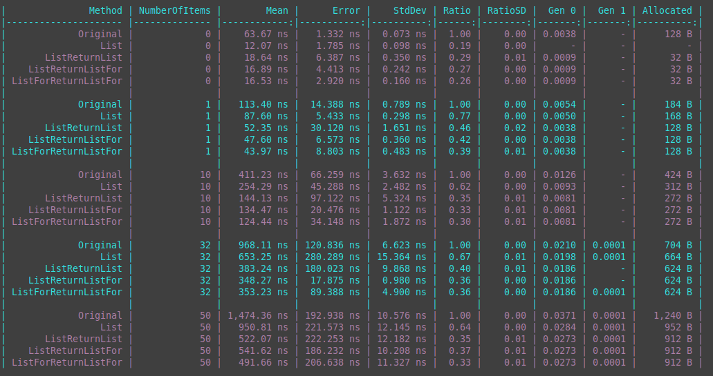

# Performance tricks I learned from contributing to the Azure .NET SDK

As a practical learner, I've found that performance optimizations have been my biggest challenge and the place I've learned the tricks that are the most helpful. These lessons have come by trial and error. As it turns out, the Azure .NET SDK was a perfect “playground” for learning new tricks because it's maintained by people who care and give feedback. 

Over the past few years, I've contributed over fifty pull requests to the Azure .NET SDK and some of them got accepted. In this session, I'll walk you through the performance improvements I learned from my experiments. Some “superpowers” you will learn are spotting closure allocations and opportunities for memory pooling and, best of all, how to improve them. 

## Outline

.NET has been evolving over the years into a modern and high performance platform. The languages running on .NET have also been improving and allowing to fall down to lower levels without giving up on the safety guarantees too much or only where it is really needed. It is less and less needed to use unmanaged languages likek C/C++ to achieve code that performs well at scale.

## Caveats

In this talk I'm going to focus on some performance optimizations that can be done in code that is library and framework like. I won't be talking about architectural patterns like vertical or horizontal scaling. The focus is purely on code with examples in CSharp. Some of the optimizations shown here can be seen as esoteric in typical line of business applications and I wouldn't recommend jumping to conclusions and applying those everywhere. Yet it is important to note that for code that is executed under scale optimizations on code can bring a lot of benefit to the table due to not only being fast but also being more efficient in resource usage, execution time, throughput and memory usage.

But what does at scale even mean? How can I find out whether the optimizations I'm trying to make have value and I'm not getting called out by my colleagues for premature optimizations?

## What does at scale mean?

I've heard it countless times already: "Wow that's crazy, is the complexity of this change really worth it? Isn't that premature optimization?" While it is true that performance improvements can be addictive, it is also true that nobody likes to optimize code that is "fast enough" or is only executed a few times day on a background job. 

David Fowler: Scale for an application can mean the number of users that will concurrently connect to the application at any given time, the amount of input to process (for example the size of the data) or the number of times data needs to be processed (for example the number of requests per second). For us as engineers it means we have to know what to ignore and knowing what to pay close attention to.

A good way to explore what scale means is to discover the assumptions that have accumulated over time in a given code base by paying close attention to what is instantiated, parsed, processed etc. per request and how those assumptions in the code base affect the performance characteristics (memory, throughput...) at scale.

## General rules of thumb

- Avoid excessive allocations to avoid the GC overhead
  - Be aware of closure allocations
  - Be aware of params overload
  - Where possible and feasible use value types but pay attention to unnecessary boxing
  - Think twice before using LINQ or unnecessary enumeration on the hot path
  - Pool and re-use buffers
  - For smaller local buffers consider using the stack
- Avoid unnecessary copying of memory

## Brief overview over the terminologies used

Quick sample of Azure Service Bus SDK
Explain the layering

## Avoid excessive allocations

### Think twice before using LINQ or unnecessary enumeration on the hot path

LINQ is great and I wouldn't want to miss it at all. Yet on the hot path it is far to easy to get into troubles with LINQ because it can cause hidden allocations and is difficult for the JIT to optimize. Let's look at a piece of code from the `AmqpReceiver`

```csharp

public class AmqpReceiver 
{
    ConcurrentBag<Guid> _requestResponseLockedMessages = new ();
    
    public Task CompleteAsync(IEnumerable<string> lockTokens) => CompleteInternalAsync(lockTokens);
    
    private Task CompleteInternalAsync(IEnumerable<string> lockTokens) 
    {
        Guid[] lockTokenGuids = lockTokens.Select(token => new Guid(token)).ToArray();
        if (lockTokenGuids.Any(lockToken => _requestResponseLockedMessages.Contains(lockToken))) 
        {
          // do special path accessing lockTokenGuids
          return Task.CompletedTask;
        }
        // do normal path accessing lockTokenGuids
        return Task.CompletedTask;
    }
}
```
The public API accepts the broadest possible enumeration type `IEnumerable<T>` by design and then converts the strings into `Guid`. Then it checks by using `Any` whether there is a lock token contained in the provided tokens that was previously already seen. Let's look how the code looks like in the decompiler

```csharp
public class AmqpReceiver
{
    [Serializable]
    [CompilerGenerated]
    private sealed class <>c
    {
        public static readonly <>c <>9 = new <>c();

        public static Func<string, Guid> <>9__2_0;

        internal Guid <CompleteInternalAsync>b__2_0(string token)
        {
            return new Guid(token);
        }

    }

    // omitted for brevity

    private Task CompleteInternalAsync(IEnumerable<string> lockTokens)
    {
        Enumerable.Any(Enumerable.ToArray(Enumerable.Select(lockTokens, <>c.<>9__2_0 ?? (<>c.<>9__2_0 = new Func<string, Guid>(<>c.<>9.<CompleteInternalAsync>b__2_0)))), new Func<Guid, bool>(<CompleteInternalAsync>b__2_1));
        return Task.CompletedTask;
    }

    [CompilerGenerated]
    private bool <CompleteInternalAsync>b__2_1(Guid lockToken)
    {
        return Enumerable.Contains(_requestResponseLockedMessages, lockToken);
    }
}
```

For every call of CompleteInternalAsync a new instance of `Func<Guid, bool>` is allocated that points to `<CompleteInternalAsync>b__2_1`. A closure captures the `_requestResponseLockedMessages` and the `lockToken` as state. This allocation is unnecessary. 

```csharp
    public Task CompleteAsync(IEnumerable<string> lockTokens) => CompleteInternalAsync(lockTokens);

    private Task CompleteInternalAsync(IEnumerable<string> lockTokens) 
    {
        Guid[] lockTokenGuids = lockTokens.Select(token => new Guid(token)).ToArray();
        foreach (var tokenGuid in lockTokenGuids) 
        {
           if (_requestResponseLockedMessages.Contains(tokenGuid))
           {
               return Task.CompletedTask;
           }
        }
        return Task.CompletedTask;
    }
```

get decompiled down to

```csharp
    private Task CompleteInternalAsync(IEnumerable<string> lockTokens)
    {
        Guid[] array = Enumerable.ToArray(Enumerable.Select(lockTokens, <>c.<>9__2_0 ?? (<>c.<>9__2_0 = new Func<string, Guid>(<>c.<>9.<CompleteInternalAsync>b__2_0))));
        int num = 0;
        while (num < array.Length)
        {
            Guid item = array[num];
            if (_requestResponseLockedMessages.Contains(item))
            {
                return Task.CompletedTask;
            }
            num++;
        }
        return Task.CompletedTask;
    }
```

Let's see what we got here.


By getting rid of the `Any` we were able to squeeze out some good performance improvements. Sometimes though we can do even more. For example there are a few general rules we can fully when we turn a refactor a code path using LINQ to collection based operations. 

- Use `Array.Empty<T>` to represent empty arrays
- Use `Enumerable.Empty<T>` to represent empty enumerables
- When the size of the items to be added to the collection are known upfront initialize the collection with the correct count to prevent the collection from growing and thus allocating more and reshuffling things internally
- Use the concrete collection type instead of interfaces or abstract types. For example when enumerating through a `List<T>` with `foreach` it uses a non-allocating `List<T>.Enumerator` struct. But when it is used through for example `IEnumerable<T>` that struct is boxed to `IEnumerator<T>` in the foreach and thus allocates.
- With more modern CSharp versions that have good pattern matching support it is sometimes possible to do a quick type check and based on the underlying collection type get access to the count without having to use `Count()`. With .NET 6 and later it is also possible to use [`Enumerable.TryGetNonEnumeratedCount`](https://docs.microsoft.com/en-us/dotnet/api/system.linq.enumerable.trygetnonenumeratedcount) which internally does collection type checking to get the count without enumerating.
- Wait with instantiating collections until you really need them.

```csharp

List<object> data = data = Enumerable.Repeat(new SomeClass(), NumberOfItems).Cast<object>().ToList();

public List<SomeClass> Original()
{
    var copyList = new List<SomeClass>();
    foreach (var value in GetValue<SomeClass>())
    {
        copyList.Add(value);
    }

    return copyList;
}

IEnumerable<TValue> GetValue<TValue>()
{
    return data.Cast<TValue>();
}
```

```csharp
public List<SomeClass> List()
{
    List<SomeClass> copyList = null;
    var enumerable = GetValueList<SomeClass>();
    foreach (var value in enumerable)
    {
        copyList ??= enumerable is IReadOnlyCollection<SomeClass> readOnlyList
            ? new List<SomeClass>(readOnlyList.Count)
            : new List<SomeClass>();

        copyList.Add(value);
    }

    return copyList;
}

IEnumerable<TValue> GetValueList<TValue>()
{
    List<TValue> values = null;
    foreach (var item in data)
    {
        values ??= new List<TValue>(data.Count);
        values.Add((TValue)item);
    }
    return values ?? Enumerable.Empty<TValue>();
}
```

by slightly tweaking `GetValueList`

```csharp
List<TValue> GetValueListReturnList<TValue>()
{
    var values = new List<TValue>(data.Count);
    foreach (var item in data)
    {
        values.Add((TValue)item);
    }
    return values;
}
```

or turning the `GetValueListReturnList` `foreach` into a `for` loop

```csharp
List<TValue> GetValueListReturnListFor<TValue>()
{
    var values = new List<TValue>(data.Count);
    for (var index = 0; index < data.Count; index++)
    {
        var item = data[index];
        values.Add((TValue) item);
    }

    return values;
}
```

and then combining that with replacing the outer `foreach` with a `for` loop as well

```csharp
public List<SomeClass> ListForReturnListFor()
{
    List<SomeClass> copyList = null;
    var enumerable = GetValueListReturnListFor<SomeClass>();
    for (var index = 0; index < enumerable.Count; index++)
    {
        var value = enumerable[index];
        copyList ??= enumerable is IReadOnlyCollection<SomeClass> readOnlyList
            ? new List<SomeClass>(readOnlyList.Count)
            : new List<SomeClass>();

        copyList.Add(value);
    }

    return copyList;
}
```



Yet again it is important to not just blindly fall into the trap of trying to optimize things. The context of the piece of code that you are trying to optimize is crucial. For example if you are trying to optimize something that uses `IEnumerable` that is passed based on the user input like in the case of the `AmqReceiver` by applying the rules above you might turn this piece of code:

```csharp
public Task CompleteAsync(IEnumerable<string> lockTokens) => CompleteInternalAsync(lockTokens);

private Task CompleteInternalAsync(IEnumerable<string> lockTokens) 
{
    Guid[] lockTokenGuids = lockTokens.Select(token => new Guid(token)).ToArray();
    foreach (var tokenGuid in lockTokenGuids) 
    {
        if (_requestResponseLockedMessages.Contains(tokenGuid))
        {
            return Task.CompletedTask;
        }
    }
    return Task.CompletedTask;
}
```

into something like

```csharp
public Task CompleteAsync(IEnumerable<string> lockTokens)
{
    IReadOnlyCollection<string> readOnlyCollection = lockTokens switch
    {
        IReadOnlyCollection<string> asReadOnlyCollection => asReadOnlyCollection,
        _ => lockTokens.ToArray(),
    };
    return CompleteInternalAsync(readOnlyCollection);
}


private Task CompleteInternalAsync(IReadOnlyCollection<string> lockTokens)
{
    int count = lockTokens.Count;
    Guid[] lockTokenGuids = count == 0 ? Array.Empty<Guid>() : new Guid[count];
    int index = 0;
    foreach (var token in lockTokens)
    {
        var tokenGuid = new Guid(token);
        lockTokenGuids[index++] = tokenGuid;
        if (_requestResponseLockedMessages.Contains(tokenGuid))
        {
            return Task.CompletedTask;
        }
    }
    return Task.CompletedTask;
}
```

let's see how this code behaves under various inputs passed as `IEnumerable<string>`.


while we managed to get some additional savings in terms of allocations over some collection types we can see actually passing an enumerable that gets lazy enumerated is behaving much worse then our first simple optimization. 

Closure Allocations SDK
Also show result of closure allocation reduction in NSB pipeline to drive the point home


## Interesting Pullrequests

- Do not copy unnecessary
  - [Not copying memory that is by design immutable](https://github.com/Azure/azure-sdk-for-net/pull/11255)
  - [Use MemoryMarshal to extract ArraySegments](https://github.com/Azure/azure-sdk-for-net/pull/19821)
  - [With knowledge of the underlying layers it is possible to achieve more](https://github.com/Azure/azure-sdk-for-net/pull/19823)
  - [Stackalloc and marshal the delivery tag](https://github.com/Azure/azure-sdk-for-net/pull/19857)
  - [Sometimes dirty tricks with a good concept achieve a lot](https://github.com/Azure/azure-sdk-for-net/pull/19996)
  - [Sender side](https://github.com/Azure/azure-sdk-for-net/pull/20098)
  - [Remove byte array allocations from AmqpReceiver DisposeMessagesAsync by buffering](https://github.com/Azure/azure-sdk-for-net/pull/20427)
  - [Use the appropriate type instead of converting all over the place](https://github.com/Azure/azure-sdk-for-net/pull/20543/files)
- Where possible and feasible use ValueTypes
  - [ValueStopWatch instead of a StopWatch](https://github.com/Azure/azure-sdk-for-net/pull/11266)
  - [Event Source remove allocations and boxing](https://github.com/Azure/azure-sdk-for-net/pull/26989)
- Closure Allocations
  - [ServiceBusRetryPolicy generic overloads to avoid closure capturing](https://github.com/Azure/azure-sdk-for-net/pull/19522)
  - [Use new state based overloads where possible to avoid closures](https://github.com/Azure/azure-sdk-for-net/pull/19884) 
  - [TrackPublishHandlerAsActiveAsync closure and synchronous invocation hint](https://github.com/Azure/azure-sdk-for-net/pull/26986/files)
- Enumerations and LINQ
  - [ServiceBusProcessor RunReceiveTaskAsync small improvements](https://github.com/Azure/azure-sdk-for-net/pull/19665) 
  - [[Azure Service Bus] Remove unnecessary LINQ on AmqpReceiver](https://github.com/Azure/azure-sdk-for-net/pull/11272)
  - [Use collection types directly and set the collection capacity if possible](https://github.com/Azure/azure-sdk-for-net/pull/20571)
  - [Transition enumerable types early and use readonly where possible](https://github.com/Azure/azure-sdk-for-net/pull/26911)

## Interesting further reading material

- [Konrad Kokosa - High-performance code design patterns in C#](https://prodotnetmemory.com/slides/PerformancePatternsLong)
- [David Fowler - Implementation details matter](https://speakerdeck.com/davidfowl/implementation-details-matter)
- [Reuben Bond - Performance Tuning for .NET Core](https://reubenbond.github.io/posts/dotnet-perf-tuning)